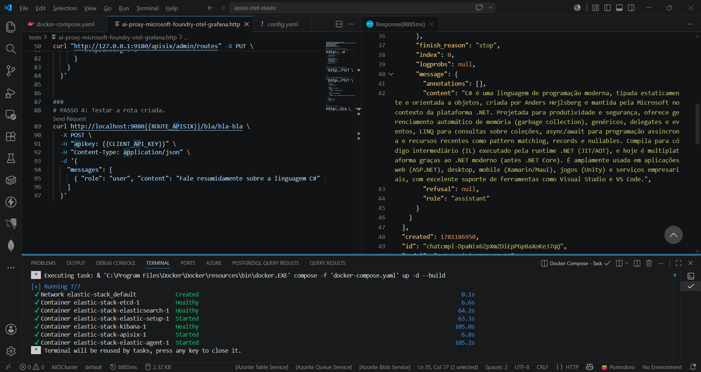
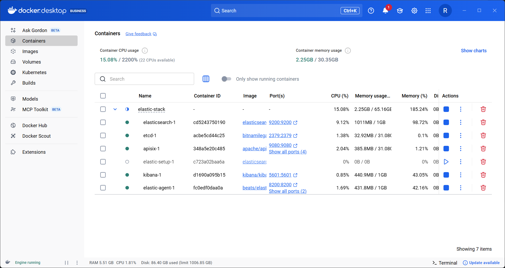
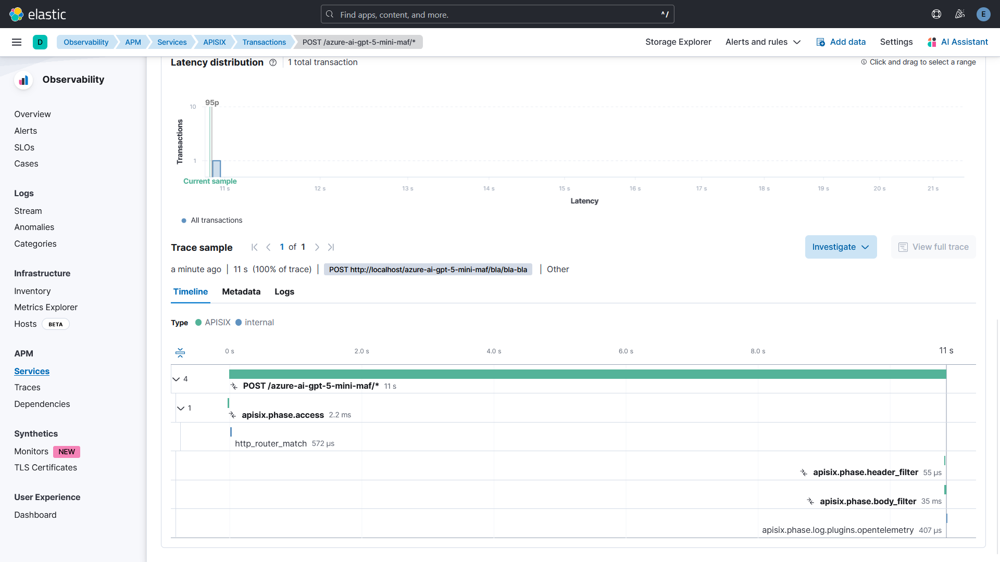
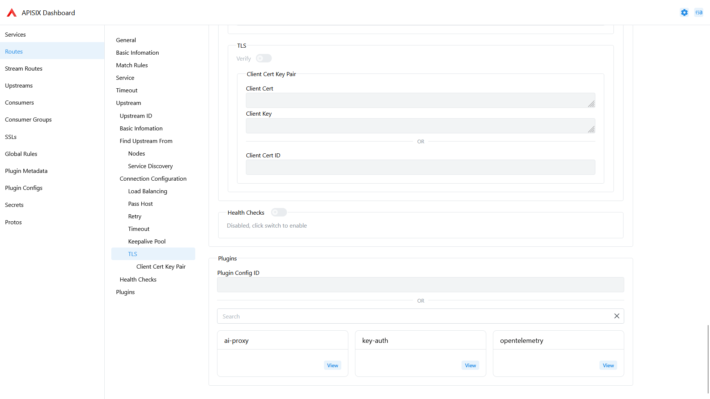

# apisix-ai-gateway-otel-elasticapm-dockercompose
Scripts do Docker Compose para subida de um ambiente do APISIX com capacidade de AI Gateway. Inclui monitoramento com Elastic APM + OpenTelemetry, com geração de traces de requisições direcionadas ao APISIX.

Deixo aqui meus agradecimentos ao amigo **Daniel Dias de Assumpção** [**@dassump**](https://github.com/dassump/) pela colaboração com o script para testes com o Elastic: **https://github.com/dassump/docker-elastic-stack**

Testes no Visual Studio Code:

Containers criados (**APISIX + etcd + stack Elastic**):

Trace no Grafana Tempo:

Rota configurada no APISIX:

